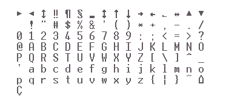

# 第三周实验 用表格形式显示字符

# 1. 实验目的

通过循环控制编程方式用表格形式显示ASCII字符表。

# 2. 实验要求

按15行×16列的表格形式显示ASCII码为`10H—100H`的所有字符，即以行为主的顺序及ASCII码递增的次序显示对应的字符。每16个字符为一行，每行中的相邻两个字符之间用空白符（ASCII为0）隔开。

# 3. 实验内容

按下面结果输出，按15行每列16个ASCII码以表格形式显示这些ASCII码

输出结果：

# 4.  实验准备

1. 编写实验内容要求的一个程序。
2. 调试程序，即修改程序参数，检查结果。
3. 熟悉源程序汇编、连接命令的使用方法。

# 5. 实验步骤

1. 启动 MASM 6.0 或 MASM for Windows 集成编程环境
2. 编写 `.ASM` 源程序，例如`HEXASC.ASM`及`DSPKEY.ASM`。
3. 对其进行汇编及连接，产生 `.EXE` 文件。
4. 如可能，修改循环指令为分支指令形式。

# 6. 实验报告要求

1. 分析要点及调试后的正确程序。
2. 实验体会。
