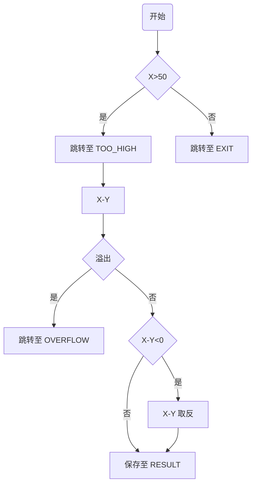

设 `X`、`Y` 均为存放在 `X` 和 `Y` 单元中的 16 位操作数，先判断 $X>50$ ，如不满足，转到 `EXIT`，如满足条件则转移到 `TOO_HIGH` 去执行，然后做 `X-Y`，如溢出则转移到 `OVERFLOW` 去执行，否则计算 $|X-Y|$，并把结果存入 `RESULT` 中。

画出程序流程图，并给出程序代码。

---



```assembly
mov ax, X
cmp ax, 50
jle EXIT
jmp TOO_HIGH

TOO_HIGH:
mov bx, Y
sub ax, bx
jo OVERFLOW
cmp ax, 0
jge save
neg ax

save:
mov RESULT, ax

OVERFLOW:

EXIT:
```
