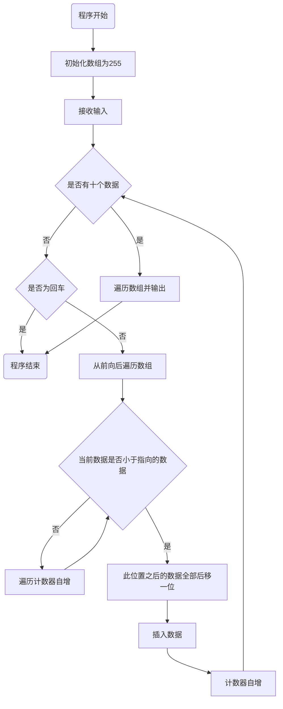

# 第三周研讨

程序要求：从键盘输入十个数据，升序输出；等待用户输入数据，如果有输入，将输入数据插入到已输入数据，升序输出，如果直接回车，程序退出。

```mermaid
graph TD
start(程序开始) --> 初始化数组为255
    --> 接收输入
    --> is10{是否有十个数据}
    --否--> isenter{是否为回车}
    --是--> exit(程序结束)
isenter --否--> 从前向后遍历数组
    --> islower{当前数据是否小于指向的数据}
    --否--> 遍历计数器自增
    --> islower
    islower --是--> 此位置之后的数据全部后移一位
    --> 插入数据
    --> 计数器自增
    --> is10

is10 --是--> 遍历数组并输出
    --> exit
```
