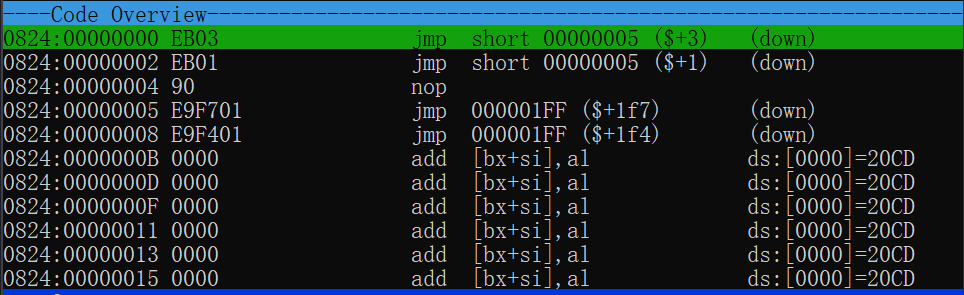
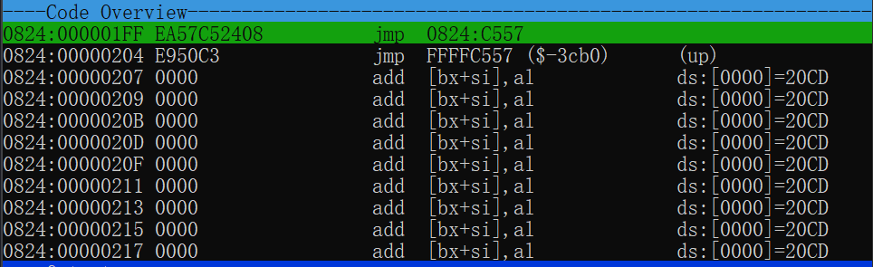

# 超出转移范围的解决方式

---

# 段内


```assembly
jmp short label
```

段内短转移，范围是-128~127

```assembly
jump near ptr label
```

段内近转移，范围是-32768~32767

超出范围可进行多次跳转，或者进行段间转移

```assembly
         jmp label_a
label_a: jmp label_b
label b: jmp label_c
...
```

---

# 段间

```assembly
jmp far ptr label
```

段间转移，会改变CS和IP的值

---

# 测试

```assembly
.model small
.code
start:
test_short:
    jmp short test_near
    jmp test_near
test_near:
    jmp near ptr test_far
    jmp test_far
    db 500 dup(0)
test_far:
    jmp far ptr exit
    jmp exit
    db 50000 dup(0)
exit:
    mov ax, 4c00h
    int 21h
end start
```

---

# 测试




