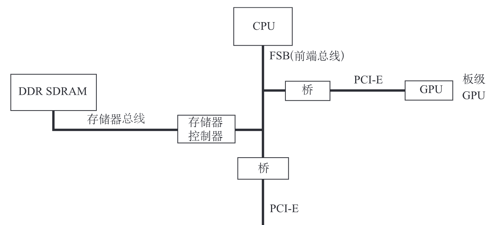
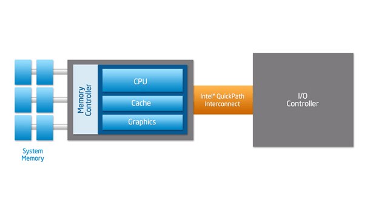

# 现代 CPU 总线

> 以 Intel® 13th 处理器为例
> 
> 汪严玮
> 
> 刘逸宸、王钧鹏、蔡骏昊
>
> 数据根据 [13th Generation Intel® Core™ Processors Datasheet](https://www.intel.com/content/www/us/en/products/docs/processors/core/core-technical-resources.html) 得来

---

# 总线的概念

总线是构成计算机系统的互联机构，是多个系统功能部件之间进行数据传送的公共通路。借助于总线连接，计算机在各系统功能部件之间实现地址、数据和控制信息的交换，并在争用资源的基础上进行工作。

---

# 总线的分类

1. CPU 内部连接各寄存器及运算部件之间的总线，称为内部总线。
2. CPU 同计算机系统的其他高速功能部件，如存储器、通道等互相连接的总线，称为系统总线。
3. 中、低速 I/O 设备之间互相连接的总线，称为 I/O 总线。

---

# 系统总线

根据课本图 6.2 所示，CPU 通过 FSB 与 其他总线前端相连，例如图上的两个桥和存储器控制器。

---

 # FSB

---

# Intel® QPI

> 参考 [Intel® QuickPath Interconnect](https://www.intel.com/content/www/us/en/io/quickpath-technology/quickpath-technology-general.html)

如图所示为 Intel® QPI 总线的结构，替代了传统的 FSB。由图中所示，内存控制器已经被集成进 CPU 内部，不再需要外部的内存控制器。

根据 Intel® 的描述，这种技术可以提供快速和点对点的连接，并且与传统并行总线不同，能够连接不同处理器核心与处理器等设备以提升数据传输速度，最高能达到 25.6 GB/s。

---

# Intel® UPI

这个技术使用在 Intel 的商用 CPU Xeon 上，替代了 Intel® QPI。这种总线将不同的 CPU 相互连接，并且使用共享的寻址空间，也就是共享不同 CPU 所连接的内存，使之成为一整块内存空间。使用了 Directory-based 技术来保证缓存一致性，最快速度可以达到 10.4 GT/s。

---

# 桥

现代 CPU 已经不仅仅是一块运算器了，而是 SoC。有一部分外部控制器已经集成入 CPU 了。

---

# 北桥

北桥是基于 Intel 处理器的个人电脑主板芯片组两枚芯片中的一枚，北桥用来处理高速信号，例如中央处理器、存储器、集成式GPU、高速总线（如PCI Express接口或AGP接口）控制器，还有与南桥之间的通信。

传统的北桥内置存储器控制器，以及连接显卡等高速设备。AMD从 Athlon 64 处理器开始把存储器控制器集成到 CPU 中，弃用 FSB 总线而改用 HyperTransport 总线，北桥的作用只剩下连接显卡等高速设备。Intel 从 Nehalem 微架构开始也把内存控制器集成到 CPU 中，弃用 FSB 总线。

对于有的芯片组，北桥会和南桥集成在同颗芯片中。有一些北桥内置显示核心，也支持 AGP 或 PCI Express 接口。集成显示核心的北桥若侦测到已安装的 PCIe/AGP 显卡，会停止其 GPU 功能，但有些北桥可以允许同时使用集成式显卡和安装外加显卡，作为多显示输出。

目前的 CPU 都集成了高速 PCIe 控制器，因此北桥成为了历史。

---

# 南桥

南桥包含大多数周边设备接口、多媒体控制器和通信接口功能。例如 PCI / 低速 PCIe 控制器、ATA/SATA 控制器、USB 控制器、网络控制器、音效控制器等。

由于 SoC 的推行，Intel 超低压 CPU、Intel Xeon D 等 Intel CPU 已经内置南桥，AMD Ryzen、EPYC 也内置了部分南桥功能。

---

# USB4

> 参考 ***Datasheet 6.0 USB-C Sub System***

传统的 USB 1.0 和 2.0 还是低速设备，但是从 3.0 开始，USB 的速度得到了极大提升，总线连接方式也与课本有所出入。

USB4 是 USB4 规范中指定的 USB 系统，USB开发者论坛于 2019 年 8 月 29 日发布了其 1.0 版本。

与以往的 USB 协议标准不同，USB4 需要 USB-C 连接器，并且要需要 USB PD 的支持以进行供电。与 USB 3.2 相比，它允许创建 DisplayPort 和 PCI Express 隧道。这种架构定义了一种与多个终端设备类型动态共享单个高速链路的方法，该方法能够最好地按类型和应用处理数据传输。USB4 产品必须支持 20 Gbit/s 的吞吐量，可支持 40 Gbit/s 的吞吐量。但由于进行了隧道传输，当传输混合数据时，即使只以 20 Gbit/s 的速率传输数据，实际的数据传输速率可能比 USB 3.2 更高。

USB4 规范基于 Thunderbolt 3 协议规范。

---

# USB4

USB4 本身不提供任何的通用数据传输机制或设备类，而是主要用于提供隧道以传输其他协议（如 USB 3.2，Displayport 和可选的 PCIe）。尽管它确实提供了本地的“主机到主机”协议，但顾名思义，它仅在两个连接的主机之间可用，并用于实现主机IP网络。因此，当主机与设备不支持可选的PCIe隧道传输时，最大非显示带宽被限制为USB 3.2 20Gbps，而仅有USB 3.2 10Gbps是强制实现。

USB4支持如下的隧道传输协议：

- USB 3.2（“增强型超高速”）隧道
- 基于DisplayPort 1.4a的隧道
- 基于PCI Express（PCIe）的隧道
