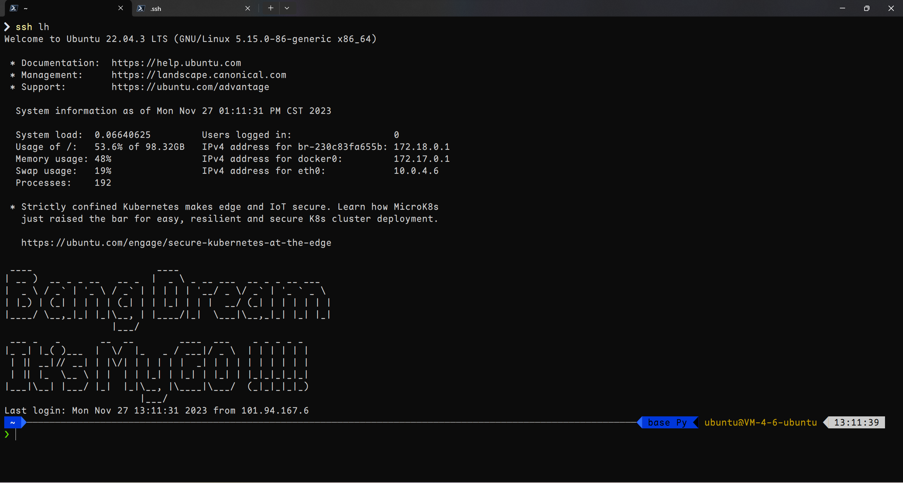
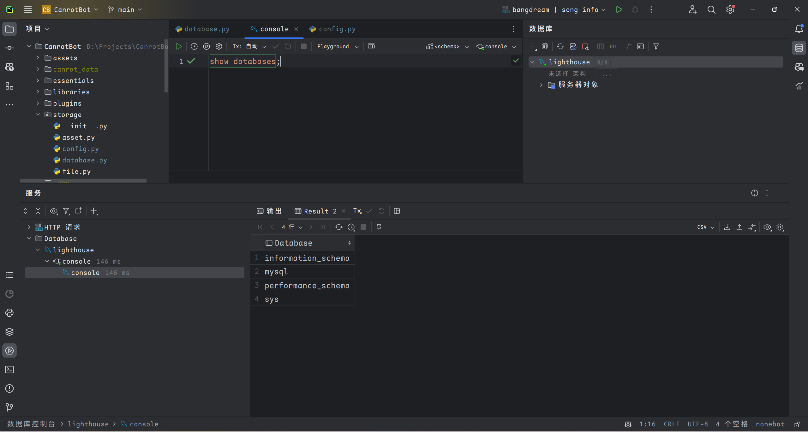
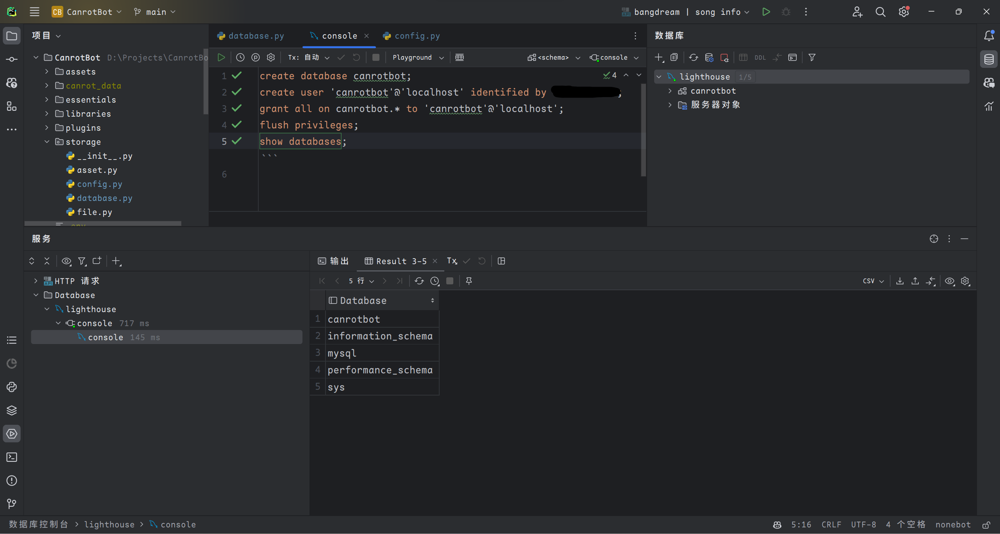

# <center>数据库原理（2）实验一报告</center>

# 一、实验要求

1. 在云服务器上启动两个实例（Server和Client）。并实现两个实例之间的SSH免密登录。
2. 在两个实例上安装MySQL，在Server上创建数据库和用户，并在Client上远程连接Server的数据库。

# 二、实验内容

## 新建服务器

购买两个云服务器实例

安装软件包
```bash
sudo apt update
sudo apt install vim mysql-server
```

## 免密登录

在Client创建密钥对并将公钥上传至服务器
```bash
ssh-keygen -t rsa -b 4096
scp id_rsa.pub ubuntu@example.com:~/.ssh
```

在Server端将公钥写入`authorized_keys`
```bash
cat id_rsa.pub >> ~/.ssh/authorized_keys
```

在Client修改本地SSH配置，实现免密登录
```bash
vim ~/.ssh/config
```

并写入如下配置
```
Host server
    HostName example.com
    Port 22
    User ubuntu
    IdentityFile ~/.ssh/id_rsa
```

之后`ssh server`即可直接登录Server端



## 连接数据库

使用SSH端口映射来连接Server的数据库，避免开放端口带来的安全隐患

将服务器的3306端口映射至本地3306，命令执行完之后没有输出
```bash
ssh -NL 3306:localhost:3306 server
```



可见数据库连接成功



# 三、收获与体会

通过这个实验,我学会了如何在云服务器上启动实例并实现两个实例之间的SSH免密登录。同时，我还学会了如何在实例上安装MySQL，并在Server上创建数据库和用户，然后在Client上通过远程连接来访问这个数据库。这个实验让我更加深入地了解了云计算的基础知识，并提高了我的Linux和数据库管理技能。
