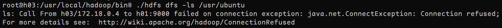

# 数据库实验二

# 一、实验要求

1. 启动三个实例（两地三中心）
2. 在三个实例中无密码的 ssh
3. 在三个实例上安装 Java 并设置环境路径
4. 同时安装伪分布模式和分布式模式 Hadoop 集群
5. 设置 HDF 中等于 3 的副本数量
6. 单独杀死 slave 和 master 实例，并讨论 HDF 的行为

# 二、实验内容

完成服务器之间的 ssh 免密连接


---

安装基本软件

```bash
sudo apt update
sudo apt install vim wget
```

---

安装基本软件和 Java

```bash
sudo apt update
sudo apt install openjdk-8-jre openjdk-8-jdk
```

设置环境变量

```bash
vim ~/.bashrc
# 插入如下一行
export JAVA_HOME=/usr/lib/jvm/java-8-openjdk-amd64
# 刷新环境
source ~/.bashrc
```


---

安装 Hadoop

```bash
wget https://archive.apache.org/dist/hadoop/common/hadoop-2.7.0/hadoop-2.7.0.tar.gz
sudo tar -zxvf Hadoop-2.7.0.tar.gz -C /usr/local
sudo mv /usr/local/hadoop-2.7.0 /usr/local/hadoop
sudo chown -R ubuntu /usr/local/hadoop/bin/hadoop
sudo ln -s /usr/local/hadoop/bin/hadoop /usr/local/bin/hadoop
```

设置环境变量

```bash
vim ~/.bashrc
# 插入如下内容
export HADOOP_HOME=/usr/local/hadoop
export PATH=$PATH:$HADOOP_HOME/bin:$HADOOP_HOME/sbin
export HADOOP_COMMON_HOME=$HADOOP_HOME 
export HADOOP_HDFS_HOME=$HADOOP_HOME 
export HADOOP_MAPRED_HOME=$HADOOP_HOME
export HADOOP_YARN_HOME=$HADOOP_HOME 
export HADOOP_INSTALL=$HADOOP_HOME 
export HADOOP_COMMON_LIB_NATIVE_DIR=$HADOOP_HOME/lib/native 
export HADOOP_CONF_DIR=$HADOOP_HOME 
export HADOOP_LIBEXEC_DIR=$HADOOP_HOME/libexec 
export JAVA_LIBRARY_PATH=$HADOOP_HOME/lib/native:$JAVA_LIBRARY_PATH
export HADOOP_CONF_DIR=$HADOOP_PREFIX/etc/hadoop
export HDFS_DATANODE_USER=root
export HDFS_DATANODE_SECURE_USER=root
export HDFS_SECONDARYNAMENODE_USER=root
export HDFS_NAMENODE_USER=root
export YARN_RESOURCEMANAGER_USER=root
export YARN_NODEMANAGER_USER=root
# 刷新环境
source ~/.bashrc
```


---

修改配置

```bash
sudo vim /usr/local/hadoop/etc/hadoop/slaves
sudo vim /usr/local/hadoop/etc/hadoop/core-site.xml
sudo vim /usr/local/hadoop/etc/hadoop/hdfs-site.xml
sudo vim /usr/local/hadoop/etc/hadoop/mapred-site.xml
sudo vim /usr/local/hadoop/etc/hadoop/yarn-site.xml
```

---

开启 Hadoop 集群

```bash
/usr/local/hadoop/sbin/start-all.sh
```


---

上传文件

```bash
hdfs dfs -mkdir -p /home/ubuntu
hdfs dfs -put ~/test.txt /home/ubuntu/test.txt
```


---

杀死 slave1，集群正常运行

杀死 master，slave2 无法连接



---

安装 Hive

```bash
cd ~
wget https://archive.apache.org/dist/hive/hive-2.1.0/apache-hive-2.1.0-bin.tar.gz
sudo tar -zxf apache-hive-2.1.0-bin.tar.gz -C /usr/local
sudo mv /usr/local/apache-hive-2.1.0 /usr/local/hive
```

修改 `/usr/local/hive/conf/hive-site.xml`

```bash
sudo vim /usr/local/hive/conf/hive-site.xml
```

运行 Hive

```bash
/usr/local/hive/bin/hive
```


