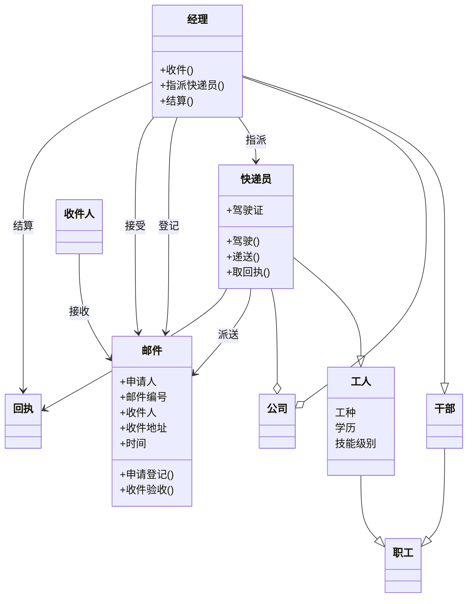

# UML

---

# 思考题

- SDK
  - 全称 Software Development Kit
  - 流行 Java, Golang, NodeJS 等
- IDE
  - 全称 Integrated Development Environment
  - 流行 Visual Studio, JetBrains IntelliJ IDEA, Android Studio 等
SDK更偏向于底层，用于辅助某一类软件；IDE是用于程序开发环境的应用程序，包括了代码编辑器、编译器、调试器、图形界面等工具。

---

- CLS
  - 全称 Common Language Specification
  - 公共语言规范
- CLR
  - 全称 Common Language Runtime
  - 公共语言运行库
- 核心是CLR
- 是，因为CLS规定了语言需要支持的特性，以便于同其他语言的互操作性

---

- Framework 是一套工具，支持之上的语言编译与运行等；Programming Language 是代码，需要框架来编译和运行
  - 主要框架 NodeJS Java 等

---

- 最熟悉
  - 语言 C#, Python, JavaScript
  - IDE  Visual Studio, IntelliJ IDEA

---

- 目的：学到dotnet更为底层的原理
