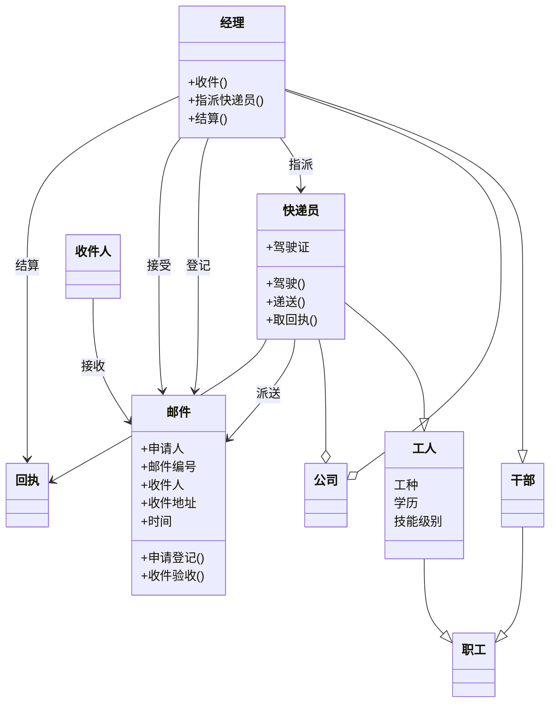

# UML

---

# 思考题

> SDK和IDE分别表示什么？其全称是什么？目前流行的SDK/IDE主要有哪些？请做简单的总结和比较。

SDK是Software Development Kit的缩写，中文意思是“软件开发工具包”。它是一个覆盖面相当广泛的名词，可以这么说：辅助开发某一类软件的相关文档、范例和工具的集合都可以叫做“SDK”。
IDE是Integrated Development Environment的缩写，中文意思是“集成开发环境”。它是一种用于程序开发环境的应用程序，一般包括代码编辑器、编译器、调试器和图形用户界面工具。就是集成了代码编写功能、分析功能、编译功能、debug功能等一体化的开发软件套。
目前流行的SDK/IDE有很多，比如Android Studio是一个流行的Android开发IDE，而Xcode是一个流行的iOS开发IDE。

---

> CLS和CLR的全称、含义是什么？哪个是Visual Studio.NET的核心成分和最重要的实体之一？

CLR是Common Language Runtime的缩写，是.NET Framework的虚拟机器元件，用来管理执行中的.NET程序。
CLS是Common Language Specification的缩写，它定义了.NET语言之间互操作所需遵循的规则和约定。它旨在确保不同语言编写的代码能够无缝协作。
CLR是Visual Studio.NET的核心成分和最重要的实体之一。

---

> 一种语言要移植到.NET中，它必须完全符合通用语言规范。这种说法对吗？为什么？

这种说法不对。一种语言要移植到.NET中，它并不需要完全符合通用语言规范（CLS）。CLS定义了.NET语言之间互操作所需遵循的规则和约定。它旨在确保不同语言编写的代码能够无缝协作。但是，一种语言可以部分符合CLS，这样它就可以与其他符合CLS的语言进行有限的互操作。
例如，IronPython是一个将Python语言移植到.NET中的项目，它并不完全符合CLS，但仍然可以在.NET环境中运行。

---

> 框架(Framework)与开发语言(Programming language)的区别？请简述目前流行的主要框架。

编程框架和编程语言是两个不同的概念。编程语言是用来编写计算机程序的一种形式语言，它包括一组语法规则和语义规则，用来定义计算机程序的结构和行为。常见的编程语言包括Java、Python、C++、C#等。

编程框架则是一种抽象层，它提供了一组通用的功能和结构，用来支持软件开发。框架通常基于特定的编程语言实现，并且提供了一种快速开发应用程序的方法。它可以帮助开发人员避免重复编写相同的代码，并且提供了一种标准化的方法来组织应用程序代码。常见的框架包括Java的Spring框架、Python的Django框架、JavaScript的Angular和Vue.js等。

目前流行的主要框架有很多，其中包括Java的Spring框架，它是一个开源的企业级应用程序开发框架；Python的Django框架，它是一个高级Web框架，用于快速开发Web应用程序；JavaScript的Angular和Vue.js框架，它们分别是一个用于构建客户端应用程序的平台和一个渐进式JavaScript框架。

---

> 你最熟悉的语言和IDE是什么？

---

> 在这门课中你的主要目的是什么？通过学习这门课，希望在哪些方面有所收获？
