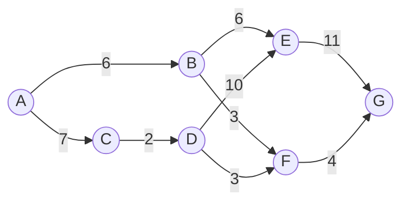

# 第3周编程作业

# 实验 1：交错数组的应用

## 实验内容、步骤和要求

将上图以交错数组的形式存储；提示用户输入一个结点的序号；求出指定结点到其他结点的最短路径。

## 实验报告

1. 分析实验内容，写出存储方案；
2. 主要设计思想；小结技术要点。

# 实验 2：程序设计题

## 1. 编写程序，计算$1000!$的末尾含有多少个$0$

> 提示：只要计算出$1000!$中含有因数$5$的个数即可

## 2. 洛书（九宫）题

给出$1,2,3,\cdots,9$这9个数字，请将它们排成一个三行三列的数字方阵，它的每行，每列和每个对角线上三个数字之和都相等，并用一个控制台程序输出。

# 实验 3：属性及索引器设置

## 实验内容：

设计一个包含 `names` 数组的类，数组可以存放 `n` 个人的姓名，每个姓名包括 `first name`，`middle name` 和 `last name`，编写完整的程序，其中包含每个数据成员的属性设置以及一个索器，用户可以输入包括 `first name`、`middle name` 和 `last name` 的姓名，也可以根据已知的 `last name`，输出姓名的全称，但是 `middle name` 只取大写的首字母。

# 实验要求

完整的程序，能够演示（包含输入输出）。

# 实验报告

解题思想。
