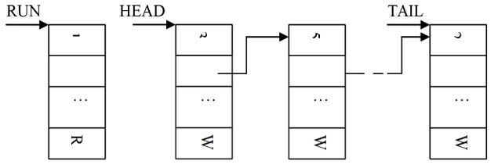

# 实验（一）操作系统的进程调度

# 一、目的与要求

## 1、目的

进程是操作系统最重要的概念之一，进程调度又是操作系统核心的主要内容。本实习要求学生独立地用高级语言编写和调试一个简单的进程调度程序。调度算法可任意选择或自行设计。例如，简单轮转法和优先数法等。本实习可加深对于进程调度和各种调度算法的理解。

## 2、要求

1. 设计一个有n个进程工行的进程调度程序。每个进程由一个进程控制块（PCB）表示。进程控制块通常应包含下述信息：进程名、进程优先数、进程需要运行的时间、占用CPU的时间以及进程的状态等，且可按调度算法的不同而增删。
2. 调度程序应包含2~3种不同的调度算法，运行时可任意选一种，以利于各种算法的分析比较。
3. 系统应能显示或打印各进程状态和参数的变化情况，便于观察诸进程的调度过程

# 二、示例

## 1、题目

本程序可选用优先数法或简单轮转法对五个进程进行调度。每个进程处于运行`R(run)`、就绪`W(wait)`和完成`F(finish)`三种状态之一，并假设起始状态都是就绪状态W。为了便于处理，程序进程的运行时间以时间片为单位计算。各进程的优先数或轮转时间片数、以及进程需要运行的时间片数，均由伪随机数发生器产生。

进程控制块结构如下：

PCB 进程标识数 链指针 优先数/轮转时间片数 占用CPU时间片数 进程所需时间片数

进程状态进程控制块链结构如下



其中：`RUN`-当前运行进程指针；`HEAD`-进程就绪链链首指针；`TAIL`-进程就绪链链尾指针。

## 2、算法与框图

### (1) 优先数法

进程就绪链按优先数大小从高到低排列，链首进程首先投入运行。每过一个时间片，运行进程所需运行的时间片数减1，说明它已运行了一个时间片，优先数也减3，理由是该进程如果在一个时间片中完成不了，优先级应该降低一级。接着比较现行进程和就绪链链首进程的优先数，如果仍是现行进程高或者相同，就让现行进程继续进行，否则，调度就绪链链首进程投入运行。原运行进程再按其优先数大小插入就绪链，且改变它们对应的进程状态，直至所有进程都运行完各自的时间片数。

### (2) 简单轮转法

进程就绪链按各进程进入的先后次序排列，进程每次占用处理机的轮转时间按其重要程度登入进程控制块中的轮转时间片数记录项（相当于优先数法的优先数记录项位置）。每过一个时间片，运行进程占用处理机的时间片数加1，然后比较占用处理机的时间片数是否与该进程的轮转时间片数相等，若相等说明已到达轮转时间，应将现运行进程排到就绪链末尾，调度链首进程占用处理机，且改变它们的进程状态，直至所有进程完成各自的时间片。

### (3) 程序框图


## 3、程序运行结果格式

### （1）程序运行结果格式

```
TYPE THE ALGORITHM:PRIORITY
OUTPUT OF PRIORITY
==============================
RUNNING PROC
2
WAITING QUEUE
3 4 1 5
==============================
ID       1  2  3  4  5
PRIORITY 9  38 30 29 0
CPUTIME  0  0  0  0  0
ALLTIME  3  3  6  3  4
STATE    W  R  W  W  W
NEXT     5  3  4  1  0
==============================
......
==============================
SYSTEM FINISHED
```

### （2）说明

程序启动后，屏幕上显示“TYPE THE ALGORITHM”，要求用户打入使用何种调度算法。本程序只编制了优先数法（"priority"）和简单轮转法（"RoundRobin"）两种。打入某一算法后，系统自动形成各进程控制块，实施该算法的进程调度算法，并打印各进程在调度过程中的状态和参数的变化。

## 4、小结

本实习简单地模拟了进程调度的二种方法，在进程运行时间和进程状态变化方面都做了简化，但已能反映进程调度的实质。通过实习能加深对进程调度的理解和熟悉它的实施方法。

# 三、实习题

（1）编制和调试示例给出的进程调度程序，并使其投入运行。

（2）自行设计或改写一个进程调度程序，在相应机器上调试和运行该程序，其功能应该不亚于示例。

提示：可编写一个反馈排队法（FB方法）的进程调度程序。该算法的基本思想是设置几个进程就绪队列，如队列1...队列i，同一队列中的进程优先级相同，可采用先进先出方法调度。各队列的进程，其优先级逐队降低。

即队列1的进程优先数最高，队列i的最低。而时间片，即以此占用CPU的时间正好相反，队列1的最短，队列i则最长。调度方法是开始进入的进程都在队列1中参加调度，如果在一个时间片内该进程完不成，应排入队列2，即优先级要降低，但下一次运行的时间可加长（即时间片加长了）。以此类推，直至排到队列i。调度时现在队列1中找，待队列1中已无进程时，再调度队列2的进程，一旦队列1中有了进程，又应返回来调度队列1的进程。这种方法最好设计成运行过程中能创造一定数量的进程，而不是一开始就生成所有进程。

提示：可综合各种算法的优先，考虑在各种不同情况下的实施方法，如上述FB算法。也可选用有关资料中报导的一些方法，加以分析、简化和实现。

（3）直观地评测各种调度算法的性能。

# 四、思考题

1. 示例中的程序，没有使用指针型（pointer）数据结构，如何用指针型结构改写本实例，使更能体现C语言的特性。
2. 如何在程序中真实地模拟进程运行的时间片？
3. 如果增加进程的“等待”状态，即进程因请求输入输出等问题而挂起的状态，如何在程序中实现？
