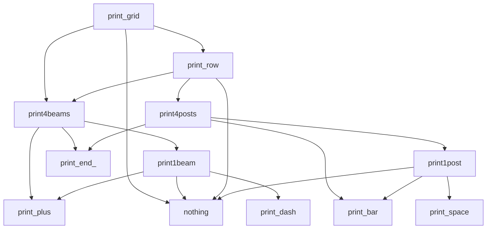

# 实验三 实验报告

# `grid.py`

调用顺序如下



`grid.py` 中将每一部分拆开画，转角处和横线都是不同函数，而自己实现的是循环，并没有将不同部分拆开来画。原版代码更具有灵活性，方便更改网格形状

# `myArray.py` 和 `myMatrix.py`

`myArray.py` 实现了类似于 `list` 的数组功能，`myMatrix.py` 则实现了矩阵与运算

其中都重载了运算符号，数组的四则运算是对所有元素进行相同的运算，而矩阵的运算符不仅有对所有元素的运算，也有矩阵运算，两者实现不同

# `Kangaroo.py`

构造函数的默认形参，使得程序出现问题

因为在 Python 中，每个函数的默认参数只会在第一次调用且没有给出这个形参的参数时运行，之后不会再次重新运行。因此在修改了 `contents` 之后，再调用的就不是空列表了

将参数的默认值改为 `None`，在函数中检测为 `None` 则赋值为空列表，避免出现问题

# 函数和数据结构复习

阿克曼函数是一种增长"极快"的函数。它是一个递归定义的函数，由两个非负整数m和n作为输入。它的定义如下：

$$
A(m,n)=\begin{cases}
n+1 & \text{if } m=0 \\
A(m-1,1) & \text{if } m>0 \text{ and } n=0 \\
A(m-1,A(m,n-1)) & \text{if } m>0 \text{ and } n>0
\end{cases}
$$

其中，当m=4，n=2时，$A(4,2)=2^{65536}-3$，这个数字大于全世界的原子数量总和¹。

根据阿克曼函数的定义，我们可以得到以下结论：

- 当m=0时，函数值为n+1；
- 当n=0时，函数值为$A(m-1,1)$；
- 当m>0且n>0时，函数值为$A(m-1,A(m,n-1))$。

因此，我们可以看出，m和n取值对函数值有很大的影响。当m和n较小时，函数值较小；当m和n较大时，函数值会急剧增长。例如，当m=3，n=3时，$A(3,3)=29$；当m=4，n=2时，$A(4,2)=2^{65536}-3$。

```python
import random

def remove_duplicates(lst):
    return list(dict.fromkeys(lst))

lst = [random.randint(0, 10) for i in range(10)]
print("Original list:", lst)
print("List with duplicates removed:", remove_duplicates(lst))

dct = {i: random.randint(0, 10) for i in range(10)}
print("Original dictionary:", dct)
print("Dictionary with duplicates removed:", {v: k for k, v in remove_duplicates(list(dct.items()))})
```

# 自定义时间类

# 马尔可夫文本分析和应用

`set` 比 `list` 更快一点，因为前者是哈希表，查找的时间复杂度为 $O(1)$

# 模拟快餐订餐场景

# 编制系列单词处理函数
